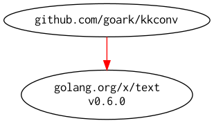

# [kkconv] -- Hiragana-Katakana Conversion

[](https://github.com/spiegel-im-spiegel/kkconv/actions)
[](https://github.com/spiegel-im-spiegel/kkconv/actions)
[](https://raw.githubusercontent.com/spiegel-im-spiegel/kkconv/master/LICENSE)
[](https://github.com/spiegel-im-spiegel/kkconv/releases/latest)

This package is required Go 1.16 or later.

## Import package

```go
import "github.com/spiegel-im-spiegel/kkconv"
```

## Usage

```go
import (
    "fmt"

    "github.com/spiegel-im-spiegel/kkconv"
)

func ExampleHiragana() {
    txt := "こんにちは ｾｶｲ"
    fmt.Println(kkconv.Hiragana(txt, true))
    // Output:
    // こんにちは せかい
}

func ExampleKatakana() {
    txt := "こんにちは ｾｶｲ"
    fmt.Println(kkconv.Katakana(txt, true))
    // Output:
    // コンニチハ セカイ
}
```

## Modules Requirement Graph

[](./dependency.png)

[kkconv]: https://github.com/spiegel-im-spiegel/kkconv "spiegel-im-spiegel/kkconv: Hiragana-Katakana Conversion"
